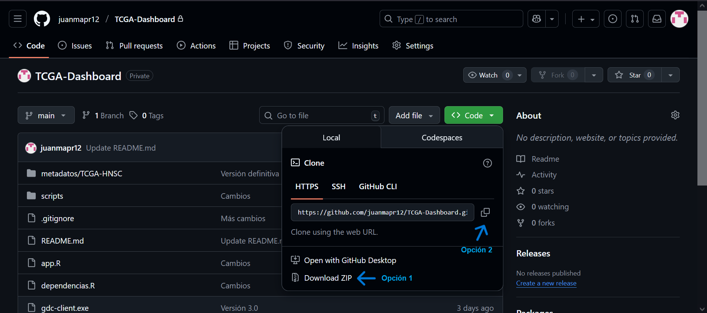

# TCGA-Dashboard

**TCGA-Dashboard** es una aplicación escrita totalmente en R que permite extraer datos ómicos heterogéneos del proyecto Atlas del Genoma del Cáncer (TCGA), aplicar técnicas tanto de carácter estadístico como de Machine Learning y finalmente visualizar los resultados obtenidos. Se parte de la premisa de proporcionar una herramienta de gran valor para el personal investigador del cáncer de cualquier universidad o institución científica.

La aplicación permite recoger dos tipos de datos: clínicos y de expresión de microARNs, con la posibilidad de escoger entre 31 cohortes diferentes provenientes del TCGA. Posteriormente el usuario tiene la opción de aplicar un preprocesado personalizado que varía según el tipo de datos tratado, con el fin de integrar los datos finales en un dataset libre de impurezas y donde se unifican los dos tipos comentados.

Seguidamente, se ofrece la posibilidad de realizar distintos análisis estadísticos tradicionales en el estudio del cáncer: 
- 🌋Expresión Diferencial
- 📈📉Supervivencia
- 📊Enriquecimiento

Por otro lado, se permite al usuario aplicar dos técnicas propias del Machine Learning: un agrupamiento no supervisado a nivel de microARN a través de un clustering jerárquico y una clasificación supervisada a través de distintos modelos, que varían desde una simple Regresión Logística hasta una separación multidimensional de los datos por parte de máquinas de vectores soporte (SVM).

En ambos casos la aplicación web proporciona la posibilidad de modificar los parámetros de modelos o variables en las que se apoyan estas técnicas, permitiendo además una rápida visualización de los resultados más significativos.

## Pasos a seguir en la instalación

1. Instalar R. Se recomienda la versión [4.4.1](https://cran.r-project.org/bin/windows/base/old/4.4.1/)

2. Instalar RStudio Desktop. Se recomienda la versión [2024.12.0](https://dailies.rstudio.com/version/2024.12.0+467/), aunque se cree que una versión superior no dará ningún tipo de problema.

3. Descargar los archivos de la rama *main* a través del botón Code/Código. Hay dos opciones:
   - 3.1. Pulsar en **Download zip** y descomprimir el archivo en local.
   - 3.2. Clonar el repositorio en una carpeta local cualquiera desde la consola de comandos a través del siguiente comando: `git clone https://github.com/juanmapr12/TCGA-Dashboard.git`. Para este segundo paso es necesario tener Git instalado en el equipo local. Si no se tiene instalado, se deja por aquí un [manual de instalación](https://git-scm.com/book/es/v2/Inicio---Sobre-el-Control-de-Versiones-Instalacion-de-Git).
   
   
4. Abrimos RStudio Desktop y en la barra de menú seleccionamos la opción **File − > New Project**. Dentro del recuadro que nos ha aparecido seleccionamos la segunda opción, *Existing Directory*. Después, pulsando en Browse buscamos la carpeta de nombre “TCGA-Dashboard” que acabamos de descargar en nuestro equipo local, y una vez seleccionada pulsamos finalmente en **Create Project**.

5. Una vez se tiene el proyecto creado, dentro de RStudio nos vamos a la ventana **“Files / Plots / Packages / Help / Viewer”**. En el primer panel llamado Files (o Archivos) deberían aparecer los archivos del proyecto. Clicamos en app.R, y se nos abre el fichero en una nueva ventana (llamada Source o Fuente) dentro de la interfaz de RStudio.

6. En la esquina superior derecha de esta ventana debe aparecer una opción llamada **Run App** junto con el conocido símbolo de ejecutar a su izquierda. Basta entonces con pulsar el botón, dejar que se carguen los distintos scripts que actúan como archivos fuente dentro de la aplicación (uno de ellos es dependencias.R, que automáticamente detecta si las librerías necesarias están instaladas o no, y en caso de esto último las instala) y esperar.

Una vez seguidos estos pasos, ya tendremos a la aplicación corriendo en local. Si surgiese algún problema durante la instalación o durante la ejecución de la aplicación, se recomienda borrar todos los objetos del espacio de trabajo (icono de la escoba en la ventana de la esquina inferior derecha), restaurar R (desde el menú: **Session -> Restart R**) y volver a ejecutar el último paso.

## Manual de usuario

